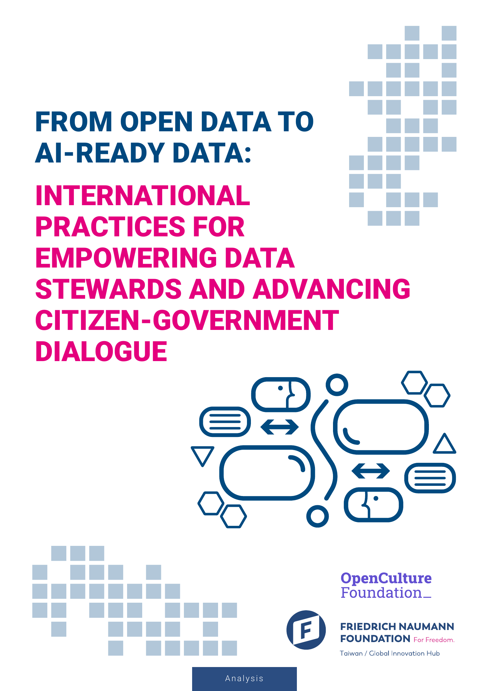
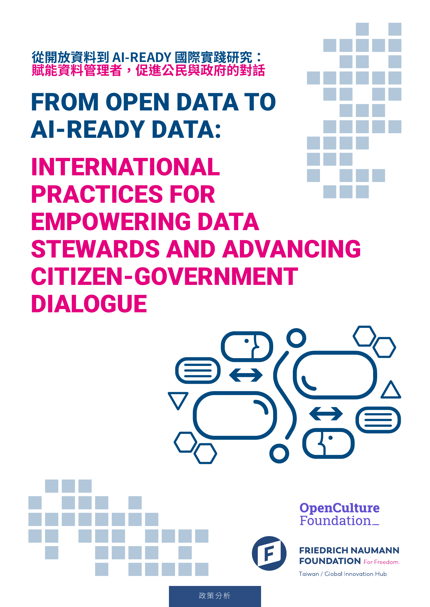

# Front Matter and Executive Summary / 前置頁與精選摘要

_Source pages: English PDF pp. 1-6; Traditional Chinese PDF pp. 1-5. This file contains material that does not belong to one of the five chapters._

## Covers / 封面

## English

### Title

From Open Data to AI-Ready Data: International Practices for Empowering Data Stewards and Advancing Citizen-Government Dialogue

### Imprint

This research report was initiated by the Open Culture Foundation (OCF), Taiwan, and supported by the Taiwan Office / Global Innovation Hub, Friedrich Naumann Foundation for Freedom (FNF).

We sincerely thank all interviewees, both domestic and international, for sharing the implementation details and practical experiences behind each case study. We also extend our gratitude to local contributors, whose hands-on experience across government agencies and civic communities helped clarify research limitations, refine analytical directions, and provide a concrete foundation for OCF's future advocacy and action.

Project title: From Open Data to AI-Ready Data: International Practices for Empowering Data Stewards and Advancing Citizen-Government Dialogue

Lead author: Open Culture Foundation (OCF)

Co-author: Taiwan Office / Global Innovation Hub, Friedrich Naumann Foundation for Freedom

Editor-in-chief: Dong Po Deng

Assistant editors: Ian Liu, Rosalind Liu

English translation: Stephen Ma

English proofreading: Peixing Liao, Warren Liu

Design and layout: Muka Wang

Managing editor: Shin-Yin Li

International interviewees: Carlos Alonso, ImpulsaDATA Project, Spain; Ingo Hinterding, Parla, Germany; Lukas Gienapp and Martin Potthast, The German Commons, Germany; Manuel Faysse, CroissantLLM, France; Try Thy, Vimoil Ourn, and Wen-Ling (Amy) Lai, Open Development Cambodia (ODC), Cambodia.

Local interviewees: Che-Hao Lin, Hsien-Li Tseng, Liang-Hsun Huang, Ronny Wang, Teemo Chuang, Ting-You Lien.

This report is jointly published by OCF and FNF and is released under the Creative Commons Attribution 4.0 International (CC BY 4.0) License.

Citation format: Open Culture Foundation; Taiwan Office / Global Innovation Hub, Friedrich Naumann Foundation for Freedom (2026). From Open Data to AI-Ready Data: International Practices for Empowering Data Stewards and Advancing Citizen-Government Dialogue.

### Table of Contents

- Executive Summary
- Chapter 1: Introduction
- Chapter 2: The Development of AI-Ready Open Data Around the World
- Chapter 3: How Open Data Becomes AI-Ready
- Chapter 4: What Environments, Policies, and Adaptive Actions Are Essential to Advance AI-Ready Data
- Chapter 5: Conclusion and Roadmap for Promoting AI-Ready Open Data

### Executive Summary

The rapid evolution of artificial intelligence (AI) necessitates a fundamental paradigm shift from traditional open data to AI-ready open data. However, the structure and formats of existing open data from government do not necessarily fully align with the requirements of AI training and applications. To empower the government and citizens to transform traditional open data into AI-ready data, this report examines international case studies spanning Spain, Germany, Cambodia, and France to establish a practical mode of operation that redesigns the release formats of government data to encourage more application of such data in AI innovation.

Government open data is essential to AI model developers because it is accessible and generally carries lower privacy and copyright risk. However, according to McKinsey & Company's report, many LLM researchers still spend around 80% of their time converting government open data into formats suitable for AI training, which shows that governments need to be empowered to transform open data into AI-ready data.

Transforming government data release from legacy document formats to machine-readable standards and rigorous data architectures is the first and most essential step for nations embracing AI-ready open data. This conversion significantly alleviates technical burdens that slow national technological development and impose heavy processing costs on enterprises.

A legal framework for open data is not sufficient on its own. Governments also need clear and comprehensive legal frameworks on data protection and intellectual property rights, and they must coordinate these frameworks because conflicts among them frequently impede progress toward AI-ready data.

Adopting international open licensing standards is critical for navigating complex regulatory landscapes, reducing institutional risk and transaction costs for developers. To ensure data persistence and reliability, agencies should move toward proactive disclosure through centralized platforms and adopt resilient, multi-tiered storage strategies that integrate local infrastructure with public repositories.

To persuade governments to transform data into AI-ready data or to open more data, trust must be built in multiple ways. Where an open data legal framework is incomplete, advocacy groups can begin by understanding government needs and selecting less sensitive topics. When public servants are hesitant, it is often more effective to demonstrate a willingness to solve concrete administrative problems, as CityLAB did by inviting civil servants to co-create AI tools through workshops.

AI-ready open data can become foundational infrastructure for social and democratic empowerment. For civil servants, optimized governance improves internal administrative efficiency; for citizens, structured and interoperable data can be combined with AI tools to analyze complex government records, lowering technical barriers and strengthening civic participation and oversight.

Even though technical tools can convert PDF-based government open data into machine-readable formats, practical experience shows that this process still loses significant information, especially the original structure, context, and logic of documents or articles. Governments should therefore prioritize machine-readable formats: CSV for numerical or statistical files, and Markdown (MD) for text files.

Because AI models can retain and propagate data risks, the corpus-building process must carefully ensure that personal and private information is not included. Since data is difficult to remove after it has entered a model, testing for personal data should happen before release or training. If removing personal data risks disrupting meaning, fixed replacement patterns can preserve sentence meaning while replacing sensitive information.

Culturally, the development of sovereign AI corpora is essential to mitigate linguistic marginalization and temporal bias within global models. High-quality local data ensures that national contexts are accurately preserved, preventing the dominance of external cultural frameworks and sustaining diverse representation in the digital age.

In summary, this report positions AI-ready data as a collective public infrastructure project dependent on sustained partnership among government, academia, and civil society. To support this transition, it offers actionable modules and roadmaps with the ultimate goal of establishing a resilient open data ecosystem in the age of AI.

## 繁體中文

### 題名

從開放資料到 AI-Ready 國際實踐研究：賦能資料管理者，促進公民與政府的對話

### 出版資訊

本研究報告由臺灣財團法人開放文化基金會發起，並由德國弗里德里希諾曼自由基金會在台辦事處 / 全球創新中心合作支持。同時，感謝國內外受訪者於研究過程中，分享各國案例背後的執行細節與實務經驗；亦感謝在地訪談者，依其於不同政府機關與社群中的實際參與經驗，協助本報告在彙整階段釐清研究限制、精進分析方向，並為本會後續推動相關倡議提供具體可行的行動基礎。

專案名稱：From Open Data to AI-Ready Data: International Practices for Empowering Data Stewards and Advancing Citizen-Government Dialogue

主要著者：財團法人開放文化基金會（OCF）

共同著者：FNF 德國弗里德里希諾曼自由基金會在台辦事處 / 全球創新中心

總編輯：Dong Po Deng 鄧東波

助理編輯：Ian Liu 劉俊彥、Rosalind Liu 劉澄真

英文翻譯：Stephen Ma 馬思揚

英文校對：Peixing Liao 廖珮杏、Warren Liu 劉維人

設計編排：Muka Wang 王俊凱

責任編輯：Shin-Yin Li 李欣穎

國際訪談：Carlos Alonso, ImpulsaDATA Project, 西班牙；Ingo Hinterding, Parla, 德國；Lukas Gienapp, Martin Potthast, The German Commons, 德國；Manuel Faysse, CroissantLLM, 法國；Try Thy, Vimoil Ourn, Wen-Ling (Amy) Lai, Open Development Cambodia (ODC), 柬埔寨。

在地訪談：王向榮、林哲豪、黃亮勳、曾憲立、連丁幼。

本報告由 OCF 與 FNF 合作發行，並以 CC BY 4.0 釋出。

引用格式：開放文化基金會、弗里德里希諾曼自由基金會在台辦事處 / 全球創新中心（2026）。從開放資料到 AI-Ready 國際實踐研究：賦能資料管理者，促進公民與政府的對話。

### 目錄

- 精選摘要
- 第一章 緒論
- 第二章 世界各地 AI-Ready 開放資料發展
- 第三章：開放資料究竟怎麼變成 AI-Ready
- 第四章：推動 AI-Ready Data 需要哪些環境、政策與調適行動
- 第五章 總結與 AI 開放資料推動藍圖

### 精選摘要

隨著人工智慧的快速發展，傳統開放資料正面臨根本性的轉型，逐步邁向「AI-ready 開放資料」。然而，現行政府開放資料的結構與格式，並不一定完全符合 AI 訓練與應用需求。為協助政府與公民社會將傳統開放資料轉化為 AI-ready 資料，本報告透過西班牙、德國、柬埔寨與法國等國際實務案例，提出從資料源頭重新設計政府資料釋出格式、促進 AI 創新應用的實務模式。

政府開放資料對 AI 模型開發者而言具有重要價值，因其通常具有較低的個人資料與著作權風險，且具備可近用性。然而，根據 McKinsey & Company 的報告，許多大型語言模型研究者仍需花費約 80% 的時間，將政府開放資料轉換為適合 AI 訓練的格式。這顯示政府需要被賦能，從傳統開放資料的釋出模式，進一步轉向 AI-ready 開放資料。

從既有文件格式轉換為機器可讀標準，並建立嚴謹的資料架構，是各國邁向 AI-ready 開放資料最基礎且關鍵的起點。此一轉型可大幅降低目前拖慢國家科技發展的技術負擔，並減輕企業在資料處理上的成本壓力。

然而，僅建立與開放資料相關的法制架構仍不足以實現 AI-ready 資料。政府亦需改善或建立清楚且完整的個人資料保護與智慧財產權法制度，並進一步協調不同法制之間的適用關係。這些制度若彼此衝突，往往會阻礙資料走向 AI-ready 的進程。

此外，採用國際開放授權標準，對於因應複雜法規環境至關重要，能有效降低機構風險與開發者的交易成本。為確保資料的長期可用性與可靠性，政府機關應由被動揭露轉向主動釋出，透過集中式平台進行管理，並採用結合在地基礎設施與公共儲存資源的多層次韌性儲存策略。

若要說服政府將資料轉化為 AI-ready 資料，或進一步開放更多資料，關鍵在於透過多種方式建立信任。在尚未具備完整開放資料法制架構的環境中，倡議組織可先從理解政府需求開始，選擇較低敏感度但具潛在影響力的主題作為切入點，藉此開啟對話，並為未來合作建立基礎。

在公務員對資料開放或 AI 應用仍感到猶豫的情況下，更有效的策略，是先展現協助解決問題的意願，從行政內部痛點著手。例如 CityLAB 透過工作坊邀請公務員提出實際工作中遇到的問題，並共同設計可回應這些問題的 AI 工具。這類非對抗式倡議與客製化技術支援，有助於降低制度轉型初期的阻力。

AI-ready 開放資料將成為促進社會與民主發展的基礎設施。對公務員而言，優化資料治理可提升內部行政效率，使資料釋出從被動、裁量性的任務，轉變為制度核心職能；對公民而言，結構化且具互通性的資料，能結合 AI 工具分析複雜的政府紀錄，降低技術門檻，強化公民參與與監督能力。

即使現有技術工具已能協助將 PDF 等政府開放資料轉換為機器可讀格式，實務經驗仍顯示，此一過程往往會遺失大量資訊，特別是原始文件或文章中的結構、脈絡與邏輯。因此，政府仍應優先以機器可讀格式釋出資料。對於數值或統計資料，CSV 是較理想的格式；對於文字型資料，Markdown（MD）則更適合作為開放釋出的基礎格式。

面對 AI 模型可能造成的資料邊緣化與風險擴散，資料語料化過程也必須更加謹慎，確保個人資料與隱私資訊不被納入訓練語料。由於資料一旦進入模型後，將難以徹底移除，無論政府最終是否決定釋出資料，都應先進行測試，以確認資料中是否包含個人資料。若開發者擔心移除個人資料會破壞資料語意或影響模型訓練，可考慮使用固定格式的替代詞彙，在保留語句意義的同時替換敏感資訊。

在文化層面，建立具主權性的 AI 語料體系，對於避免語言邊緣化與時間偏誤至關重要。高品質的在地資料有助於確保國家脈絡被正確保存，避免外來文化框架主導，並在數位時代維持多元文化的可見性。

本報告將邁向 AI-ready 開放資料定位為一項集體性的公共基礎建設工程，有賴政府、學界與公民社會的長期合作。為推動此一轉型，本報告亦提出可操作的行動模組與實踐路徑，最終目標是在 AI 時代建立具韌性的開放資料生態系。
