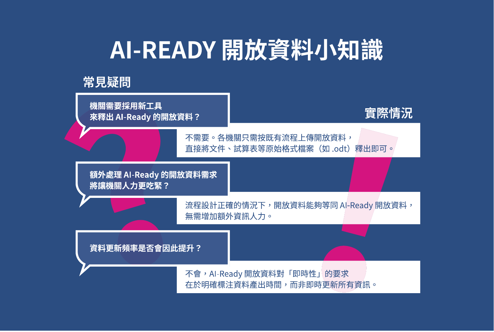

# 第一章 緒論

_Source: OCF-AI-zhtw.pdf, pp. 6-8._

## 圖片

這份報告旨在介紹從開放資料到 AI-Ready 資料這條發展路徑，其能為創新與民主治理帶來什麼貢獻，如何達成，以及世界各國的實踐為何，並從這些經驗歸納出法規與實務上的能促進更多 AI-Ready 資料的方法。

本研究期待公務人員閱讀過這份報告後，能夠理解 AI-Ready 資料的產出，並不大幅度影響現有資料開放流程，可於既有的資訊人力或軟體工具下，回頭更關注原始資料格式，及其他更新時間註記這些本於開放資料建置時的基本要求。

為鼓舞各國公務機關勇於開放高品質資料，提升全球跨文化與國家的 AI-Ready 資料量，以促進人類多元文明發展。本研究希望呈現，開放資料如何微調建置與標註方式，以期在 AI 時代能更便利地合法合規地利用，展現其價值。

同時，對於任何公民科技或開源社群的參與者，本研究也很樂見您藉由閱讀認識不同國家在 AI-Ready 資料的公私協力發展歷程後，參考其經驗、使用工具或合作方式，將本份研究輔助用於您與公務機關對話。

## 1.1 為什麼需要這份案例研究

隨著 AI 技術在 2022 年後的極速發展，LLM 對於獲取資料以進行訓練的需求逐步上升。長期以來，政府開放資料因具備公共性、可近用性，以及相對明確的授權條件，常被視為 AI 訓練的重要資料來源之一。同時，許多國家亦將 AI 視為提升國家競爭力與發展潛力的關鍵要素，使開放資料與 AI 發展之間逐漸形成一種相互影響、彼此依賴的治理循環。

然而，傳統開放資料在其在建置時，內容結構與資料格式等面向，未必能直接回應不同 AI 訓練與應用的需求。如何在維持開放資料持續釋出的同時，加速 AI 訓練流程，並確保資料在品質、結構與規格上更適合被 AI 系統理解與使用，成為各國政府與資料治理者必須面對的重要課題。怎樣從既有開放資料的提升到 AI-Ready 可用的開放資料，是本研究嘗試檢視各國的案例中，找到其可用、可參考的實務方向。

### 1.1.1 傳統開放資料定義怎為 AI 所用

論及傳統開放資料於 AI 的運用，如果以 Tim Berners-Lee (2006)[^1] 的開放資料評等定義的一星等級資料為比較的基準，會發現基礎即是以「開放」授權為核心達到基礎的近用。到了二星、三星的機器可讀及採開放格式，因不同運用需求，而採不同格式資料尤為重要。以 LLM 大型語言訓練需求為例，過往臺灣政府資料開放平臺中各機關以釋出 CSV 格式為大宗，但因許多欄位名稱、詮釋資料 (Metadata) 的建置不精準，導致在訓練過程中，易導致訓練出來的模型解讀資料時語意模糊；反之 LLM 所需的 Markdown (MD) 格式甚至被稱之 LLM 的原生語言，則可以方便處理大量文章、報告類型的文字的結構化。同樣地，在四星、五星評等下的開放資料，政府機關如要產製有其門檻，但其賦予固定 URI 位置或具備語意的鏈結資料網絡，這些的特性亦是發展多元 AI 助理時，極具價值的技術基礎。

另外再以多模態 AI 的訓練需求為例：圖片、聲音、地圖圖資、多媒體的資料，亦是發展成主權 AI 所需乘載更多文化內涵的資料，然而怎有好的詮釋資料的建構，亦是發展主權 AI 重要核心。以往台灣有很多有價值的文史或政府報告資料，其常見的原始留存檔案多為 PDF 檔案，而因為要符合政府開放資料的規範，公務機關會盡可能希望再將這類檔案轉成其他的可機讀格式。在這個過程中，那些因為排版需求，內崁無法機讀圖片、混雜表格、多欄版面的設計，會造成機器解讀不易得問題。但是因為近年隨著 AI 技術成熟，光學字元辨識（OCR）與自動版面判讀等開源工具的進展，讓此類資料更有機會納入訓練流程。若能再進一步搭配更完善的詮釋資料建置，例如在這些類型的資料的詮釋資料中清楚標示文件結構與目錄資訊，將能進一步提升自動判讀的準確性，讓 AI 訓練或應用皆有更豐富的來源。

### 1.1.2 提升至「AI-Ready 資料」的意涵

在本研究中，所關注之核心在於：如何由既有開放資料出發，逐步提升至「AI-Ready 開放資料」。在此精進過程，臺灣目前參考歐盟所提出之資料治理 FAIR 原則 [^2]，從資料的可發現性（Findable）、可近用性（Accessible）、互通性（Interoperable）與可重用性（Reusable）四個面向，並以詮釋資料（metadata）規範框架作為導入提升的關鍵切入點，以強化資料來源透明度與整體資料品質 [^3]。美國商務部於《Generative AI and Open Data: Guidelines and Best Practices》中指出在資料發布階段即應納入 AI 系統自動擷取與理解的需求，確保資料具備支援 AI 訓練的基礎條件（U.S. Department of Commerce, 2025）。

而世界銀行提出之《AI-Ready Development Data》概念，其從三個關鍵條件，來導引資料邁向 AI-Ready 的發展。首先，在「AI-Ready 資料系統」方面，需建構資料探索平台、應用程式介面（API）及相關技術標準的基礎建設，使資料得以被有效發現、互通與存取。其次，在「高品質資料與詮釋資料」方面，資料應具備可靠性與即時性，並搭配結構化且完整之詮釋資料，以確保機器與人類皆能正確理解其內容與脈絡。最後，在「健全治理與策略性合作」方面，透過完善政策、標準化流程及跨部門協作，確保資料品質與一致性，提升透明度，並促進資料之負責任使用，以建立對資料之信任 [^4]。

綜合上述原則，本研究所期待之「AI-Ready 開放資料」，係指資料於釋出階段即納入未來應用情境之考量，選擇適切之資料格式，並同步建置必要之詮釋資料，於必要時進一步提升其開放等級與結構化程度。其目標在於確保資料於人類與 AI 系統運用時，無論作為訓練資料、微調資料，或作為延伸存取與再利用之用途，皆能在準確度、完整度與信效度上具備良好之可用性與延展性，並降低資料誤用與模型偏誤之風險。

### 1.1.3 開放資料運用於 AI-Ready 時的注意事項

若網路資訊涉及侵權或隱私爭議，為了停止傳播，可以透過移除原始網頁或要求搜尋引擎移除索引，讓資訊隨連結失效而逐漸消逝。當 AI-Ready 資料被用於訓練 AI 模型時，資料會被轉化為數以億計的參數權重，將資訊深度內化於其複雜的神經結構中，導致 AI 有著「無法遺忘」的特性[^5]，因此在進行資料訓練前，仍需注意訓練資料是否有違反作權或合理使用規範，及含有個人隱私資料等潛在風險。

## 1.2 從開放資料對 AI 發展的具體效益

史丹佛大學李飛飛教授團隊過去曾建立 ImageNet 開放資料集，涵蓋超過 2 萬個類別，共 1400 多萬張被標註的圖片[^6]。這個資料集改變了 AI 影像辨識的發展，圖片分類準確率在 7 年內從 71.8% 到超過 95%，更成為醫學影像、自動駕駛、臉部辨識應用的訓練基礎。[^7]由此顯示高品質、良好標註的公開資料集能夠催化整個產業的技術突破，更能預期 AI-Ready 資料將對人類文明的發展帶來的實質幫助。

### 1.2.1 產業發展 創造價值

依據麥肯錫顧問公司資料，開放資料每年可在全球七大產業創造高達 5 兆美元的經濟價值。這個龐大的經濟價值源自於開放資料在 AI 訓練的運用，可見 AI-Ready 資料的巨額產業效益。[^7]

同時報告也指出，LLM 研究人員花費高達 80% 時間將政府開放資料轉換為適合 AI 訓練的格式。這反映出，若政府能直接產出 AI-Ready 資料，不只能加速國家科技發展，更能減輕該國企業高額的資料處理成本。

### 1.2.2 文化保存 穩固主權

當一個國家語言資料在公開的訓練集中的佔比極低，該國民眾在使用主流 AI 模型時，將無法獲取符合該國國情的資訊，將面臨「被邊緣化」與「被錯誤解讀」的問題。若長期處於這樣的使用情境，恐怕會潛移默化地影響使用者本身的認知，導致民眾及下一代對自身國家政治、歷史等領域產生認知偏差。這不僅對國家文史保存極具威脅，更對國家本身認同產生危機。

[^1]:  Berners-Lee, T. (2006). Linked data: Design issues, [http://www.w3.org/DesignIssues/LinkedData.html](http://www.w3.org/DesignIssues/LinkedData.html) and [https://5stardata.info/zh-TW/](https://5stardata.info/zh-TW/)

[^2]:  Ministry of Digital Affairs. (2025). *AI-Ready data metadata framework and indicator guidelines* (1st ed.). Ministry of Digital Affairs. https://www-api.moda.gov.tw/File/Get/moda/zh-tw/ae1g6Uvj4fUa4a3

[^3]:  World Bank. (2025, July 21). *From open data to AI-ready data: Building the foundations for responsible AI in development*. World Bank Blogs. https://blogs.worldbank.org/en/opendata/from-open-data-to-ai-ready-data--building-the-foundations-for-re

[^4]:  Schlarmann, Julian, and coauthors. “What Should LLMs Forget? Quantifying Personal Data in Large Language Models.” arXiv, June 1, 2025, https://arxiv.org/abs/2507.11128.

[^5]:  Deng, Jia, Wei Dong, Richard Socher, Li‑Jia Li, Kai Li, and Li Fei‑Fei. “ImageNet: A Large-Scale Hierarchical Image Database.” In 2009 IEEE Conference on Computer Vision and Pattern Recognition, 248–255. IEEE, 2009\.

[^6]:  Blaivas, Michael, and Leslie Blaivas. “Are Convolutional Neural Networks Trained on ImageNet on Par with Humans for Point-of-Care Ultrasound Classification?” Journal of Ultrasound in Medicine 40, no. 6 (2021): 1099–1107.

[^7]:  Manyika, James, Michael Chui, Diana Farrell, Steve Van Kuiken, Peter Groves, and Elizabeth Almasi Doshi. “Open Data: Unlocking Innovation and Performance with Liquid Information.” McKinsey & Company, October 2013, https://www.mckinsey.com/capabilities/tech-and-ai/our-insights/open-data-unlocking-innovation-and-performance-with-liquid-information.
# 第一章 緒論

_Source: OCF-AI-zhtw.pdf, pp. 6-8._

## 圖片

這份報告旨在介紹從開放資料到 AI-Ready 資料這條發展路徑，其能為創新與民主治理帶來什麼貢獻，如何達成，以及世界各國的實踐為何，並從這些經驗歸納出法規與實務上的能促進更多 AI-Ready 資料的方法。

本研究期待公務人員閱讀過這份報告後，能夠理解 AI-Ready 資料的產出，並不大幅度影響現有資料開放流程，可於既有的資訊人力或軟體工具下，回頭更關注原始資料格式，及其他更新時間註記這些本於開放資料建置時的基本要求。

為鼓舞各國公務機關勇於開放高品質資料，提升全球跨文化與國家的 AI-Ready 資料量，以促進人類多元文明發展。本研究希望呈現，開放資料如何微調建置與標註方式，以期在 AI 時代能更便利地合法合規地利用，展現其價值。

同時，對於任何公民科技或開源社群的參與者，本研究也很樂見您藉由閱讀認識不同國家在 AI-Ready 資料的公私協力發展歷程後，參考其經驗、使用工具或合作方式，將本份研究輔助用於您與公務機關對話。

## 1.1 為什麼需要這份案例研究

隨著 AI 技術在 2022 年後的極速發展，LLM 對於獲取資料以進行訓練的需求逐步上升。長期以來，政府開放資料因具備公共性、可近用性，以及相對明確的授權條件，常被視為 AI 訓練的重要資料來源之一。同時，許多國家亦將 AI 視為提升國家競爭力與發展潛力的關鍵要素，使開放資料與 AI 發展之間逐漸形成一種相互影響、彼此依賴的治理循環。

然而，傳統開放資料在其在建置時，內容結構與資料格式等面向，未必能直接回應不同 AI 訓練與應用的需求。如何在維持開放資料持續釋出的同時，加速 AI 訓練流程，並確保資料在品質、結構與規格上更適合被 AI 系統理解與使用，成為各國政府與資料治理者必須面對的重要課題。怎樣從既有開放資料的提升到 AI-Ready 可用的開放資料，是本研究嘗試檢視各國的案例中，找到其可用、可參考的實務方向。

### 1.1.1 傳統開放資料定義怎為 AI 所用

論及傳統開放資料於 AI 的運用，如果以 Tim Berners-Lee (2006)[^1] 的開放資料評等定義的一星等級資料為比較的基準，會發現基礎即是以「開放」授權為核心達到基礎的近用。到了二星、三星的機器可讀及採開放格式，因不同運用需求，而採不同格式資料尤為重要。以 LLM 大型語言訓練需求為例，過往臺灣政府資料開放平臺中各機關以釋出 CSV 格式為大宗，但因許多欄位名稱、詮釋資料 (Metadata) 的建置不精準，導致在訓練過程中，易導致訓練出來的模型解讀資料時語意模糊；反之 LLM 所需的 Markdown (MD) 格式甚至被稱之 LLM 的原生語言，則可以方便處理大量文章、報告類型的文字的結構化。同樣地，在四星、五星評等下的開放資料，政府機關如要產製有其門檻，但其賦予固定 URI 位置或具備語意的鏈結資料網絡，這些的特性亦是發展多元 AI 助理時，極具價值的技術基礎。

另外再以多模態 AI 的訓練需求為例：圖片、聲音、地圖圖資、多媒體的資料，亦是發展成主權 AI 所需乘載更多文化內涵的資料，然而怎有好的詮釋資料的建構，亦是發展主權 AI 重要核心。以往台灣有很多有價值的文史或政府報告資料，其常見的原始留存檔案多為 PDF 檔案，而因為要符合政府開放資料的規範，公務機關會盡可能希望再將這類檔案轉成其他的可機讀格式。在這個過程中，那些因為排版需求，內崁無法機讀圖片、混雜表格、多欄版面的設計，會造成機器解讀不易得問題。但是因為近年隨著 AI 技術成熟，光學字元辨識（OCR）與自動版面判讀等開源工具的進展，讓此類資料更有機會納入訓練流程。若能再進一步搭配更完善的詮釋資料建置，例如在這些類型的資料的詮釋資料中清楚標示文件結構與目錄資訊，將能進一步提升自動判讀的準確性，讓 AI 訓練或應用皆有更豐富的來源。

### 1.1.2 提升至「AI-Ready 資料」的意涵

在本研究中，所關注之核心在於：如何由既有開放資料出發，逐步提升至「AI-Ready 開放資料」。在此精進過程，臺灣目前參考歐盟所提出之資料治理 FAIR 原則 [^2]，從資料的可發現性（Findable）、可近用性（Accessible）、互通性（Interoperable）與可重用性（Reusable）四個面向，並以詮釋資料（metadata）規範框架作為導入提升的關鍵切入點，以強化資料來源透明度與整體資料品質 [^3]。美國商務部於《Generative AI and Open Data: Guidelines and Best Practices》中指出在資料發布階段即應納入 AI 系統自動擷取與理解的需求，確保資料具備支援 AI 訓練的基礎條件（U.S. Department of Commerce, 2025）。

而世界銀行提出之《AI-Ready Development Data》概念，其從三個關鍵條件，來導引資料邁向 AI-Ready 的發展。首先，在「AI-Ready 資料系統」方面，需建構資料探索平台、應用程式介面（API）及相關技術標準的基礎建設，使資料得以被有效發現、互通與存取。其次，在「高品質資料與詮釋資料」方面，資料應具備可靠性與即時性，並搭配結構化且完整之詮釋資料，以確保機器與人類皆能正確理解其內容與脈絡。最後，在「健全治理與策略性合作」方面，透過完善政策、標準化流程及跨部門協作，確保資料品質與一致性，提升透明度，並促進資料之負責任使用，以建立對資料之信任 [^4]。

綜合上述原則，本研究所期待之「AI-Ready 開放資料」，係指資料於釋出階段即納入未來應用情境之考量，選擇適切之資料格式，並同步建置必要之詮釋資料，於必要時進一步提升其開放等級與結構化程度。其目標在於確保資料於人類與 AI 系統運用時，無論作為訓練資料、微調資料，或作為延伸存取與再利用之用途，皆能在準確度、完整度與信效度上具備良好之可用性與延展性，並降低資料誤用與模型偏誤之風險。

### 1.1.3 開放資料運用於 AI-Ready 時的注意事項

若網路資訊涉及侵權或隱私爭議，為了停止傳播，可以透過移除原始網頁或要求搜尋引擎移除索引，讓資訊隨連結失效而逐漸消逝。當 AI-Ready 資料被用於訓練 AI 模型時，資料會被轉化為數以億計的參數權重，將資訊深度內化於其複雜的神經結構中，導致 AI 有著「無法遺忘」的特性[^5]，因此在進行資料訓練前，仍需注意訓練資料是否有違反作權或合理使用規範，及含有個人隱私資料等潛在風險。

## 1.2 從開放資料對 AI 發展的具體效益

史丹佛大學李飛飛教授團隊過去曾建立 ImageNet 開放資料集，涵蓋超過 2 萬個類別，共 1400 多萬張被標註的圖片[^6]。這個資料集改變了 AI 影像辨識的發展，圖片分類準確率在 7 年內從 71.8% 到超過 95%，更成為醫學影像、自動駕駛、臉部辨識應用的訓練基礎。[^7]由此顯示高品質、良好標註的公開資料集能夠催化整個產業的技術突破，更能預期 AI-Ready 資料將對人類文明的發展帶來的實質幫助。

### 1.2.1 產業發展 創造價值

依據麥肯錫顧問公司資料，開放資料每年可在全球七大產業創造高達 5 兆美元的經濟價值。這個龐大的經濟價值源自於開放資料在 AI 訓練的運用，可見 AI-Ready 資料的巨額產業效益。[^7]

同時報告也指出，LLM 研究人員花費高達 80% 時間將政府開放資料轉換為適合 AI 訓練的格式。這反映出，若政府能直接產出 AI-Ready 資料，不只能加速國家科技發展，更能減輕該國企業高額的資料處理成本。

### 1.2.2 文化保存 穩固主權

當一個國家語言資料在公開的訓練集中的佔比極低，該國民眾在使用主流 AI 模型時，將無法獲取符合該國國情的資訊，將面臨「被邊緣化」與「被錯誤解讀」的問題。若長期處於這樣的使用情境，恐怕會潛移默化地影響使用者本身的認知，導致民眾及下一代對自身國家政治、歷史等領域產生認知偏差。這不僅對國家文史保存極具威脅，更對國家本身認同產生危機。

[^1]:  Berners-Lee, T. (2006). Linked data: Design issues, [http://www.w3.org/DesignIssues/LinkedData.html](http://www.w3.org/DesignIssues/LinkedData.html) and [https://5stardata.info/zh-TW/](https://5stardata.info/zh-TW/)

[^2]:  Ministry of Digital Affairs. (2025). *AI-Ready data metadata framework and indicator guidelines* (1st ed.). Ministry of Digital Affairs. https://www-api.moda.gov.tw/File/Get/moda/zh-tw/ae1g6Uvj4fUa4a3

[^3]:  World Bank. (2025, July 21). *From open data to AI-ready data: Building the foundations for responsible AI in development*. World Bank Blogs. https://blogs.worldbank.org/en/opendata/from-open-data-to-ai-ready-data--building-the-foundations-for-re

[^4]:  Schlarmann, Julian, and coauthors. “What Should LLMs Forget? Quantifying Personal Data in Large Language Models.” arXiv, June 1, 2025, https://arxiv.org/abs/2507.11128.

[^5]:  Deng, Jia, Wei Dong, Richard Socher, Li‑Jia Li, Kai Li, and Li Fei‑Fei. “ImageNet: A Large-Scale Hierarchical Image Database.” In 2009 IEEE Conference on Computer Vision and Pattern Recognition, 248–255. IEEE, 2009\.

[^6]:  Blaivas, Michael, and Leslie Blaivas. “Are Convolutional Neural Networks Trained on ImageNet on Par with Humans for Point-of-Care Ultrasound Classification?” Journal of Ultrasound in Medicine 40, no. 6 (2021): 1099–1107.

[^7]:  Manyika, James, Michael Chui, Diana Farrell, Steve Van Kuiken, Peter Groves, and Elizabeth Almasi Doshi. “Open Data: Unlocking Innovation and Performance with Liquid Information.” McKinsey & Company, October 2013, https://www.mckinsey.com/capabilities/tech-and-ai/our-insights/open-data-unlocking-innovation-and-performance-with-liquid-information.
