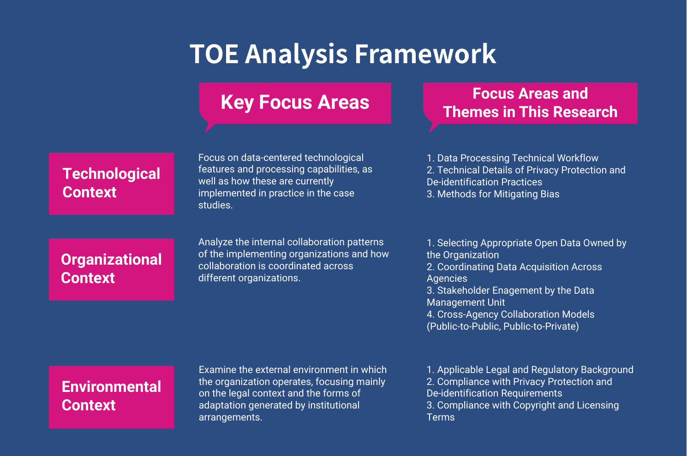
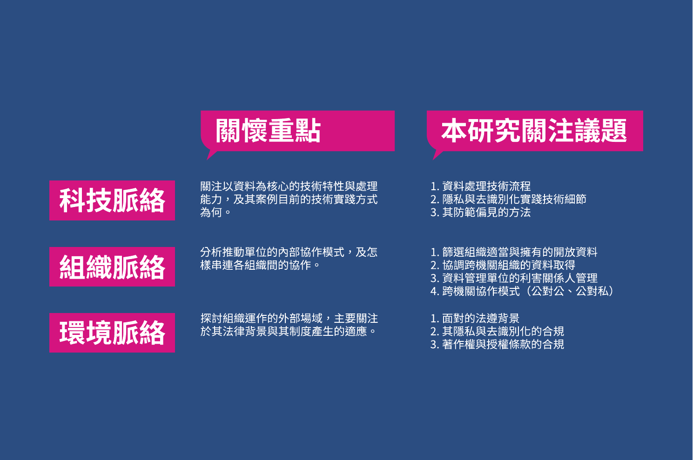
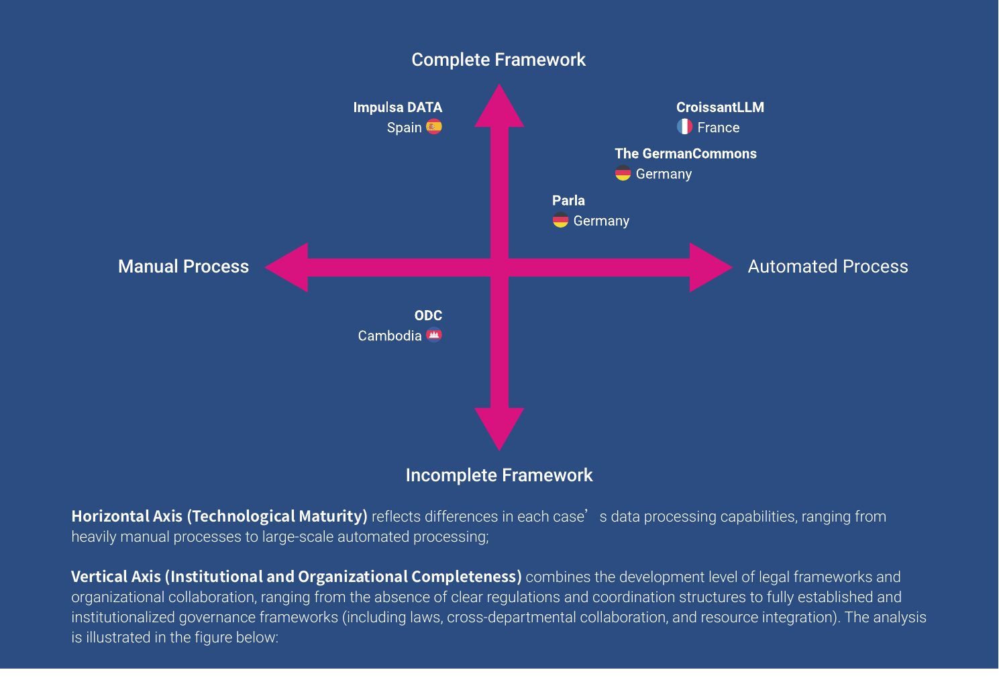
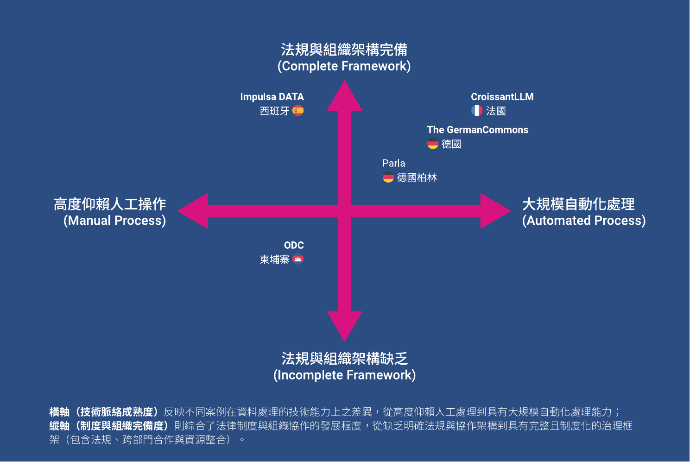
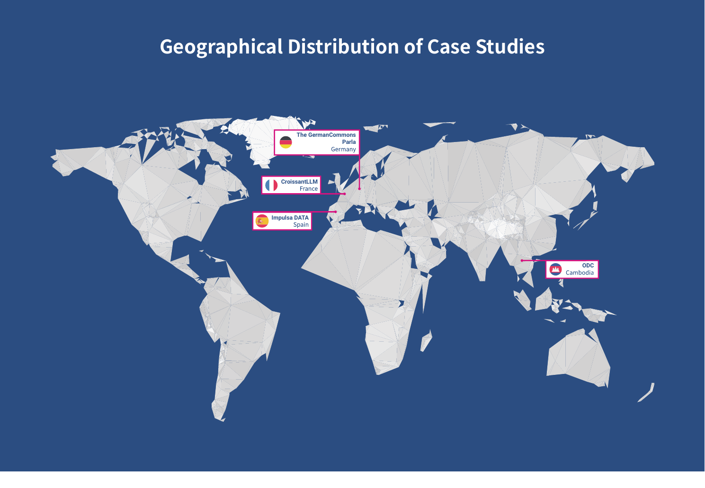
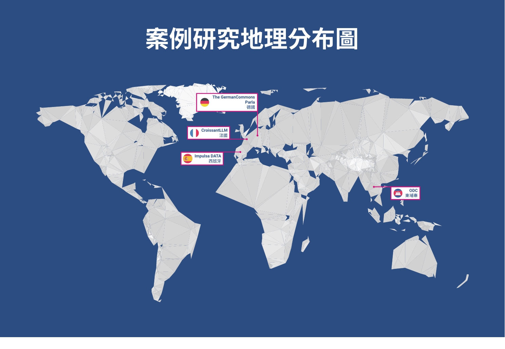

# Chapter 2: The Development of AI-Ready Open Data Around the World / 第二章 世界各地 AI-Ready 開放資料發展

_Source pages: English PDF pp. 10-13; Traditional Chinese PDF pp. 9-12. Paragraph order is kept parallel by section where the two PDFs correspond._

## Figures / 圖片

## English

This chapter first introduces how AI-ready open data is being implemented across diverse jurisdictions, along with case studies drawn from this research’s interviews with several related projects and organizations. These examples aim to give readers a concrete understanding of the practical use of AI-ready data.

They also demonstrate how the pathways of achieving AI-ready data in different countries have been shaped by their different institutional contexts and policy objectives, and thereby making each country's implementation models various. This will help us to foresee different countries' policy trends and development in AI-ready data.

### 2.1 Global and Taiwan Development Trends

This section first compares four major trends in the development of AI-ready data worldwide and examines the specific trajectory adopted by Taiwan.

#### 2.1.1 Development Paths of Countries Worldwide

The development of open data can be broadly categorized into three paths. The first one is scale- and market-oriented, exemplified by the United States, which leverages federal government data to drive AI applications and has issued related guidelines and standards. The second path emphasizes regulation and trust; for example, the European Union ensures data release through legally binding directives and stresses the sustainable development of the AI economy under a robust regulatory framework. The third path focuses on digital sovereignty, as seen in Arabic-speaking countries, which carefully assess what data can be made public in order to protect local languages and cultures.

East Asian countries and Singapore largely adopt hybrid approaches. Japan, influenced by population aging and labor shortages, grants greater flexibility in data use to accelerate AI development. South Korea and Singapore are led by their governments in planning, treating data governance and AI as elements of national competitiveness, and promoting data circulation and AI applications through policies and institutional frameworks.

#### 2.1.2 Recent Developments in Taiwan

Since 2012, Taiwan has promoted the opening of government data, and by the end of 2020, over 48,000 datasets had been released. In 2020, the ’Digital Government Program 2.0’ initiative was launched, emphasizing data quality and prioritizing high-value areas such as transportation, healthcare, and the environment. Following the establishment of the Ministry of Digital Affairs, Taiwan has launched the ’Open Data 2.0’ program, facilitating data structuring, API applications, and cross-domain collaboration to support AI training.

With the rise of generative AI, Taiwan has demonstrated a proactive commitment to constructing sovereign AI corpora.

In 2023, the National Science and Technology Council launched TAIDE, integrating diverse local datasets to create large-scale traditional Chinese language models. The Ministry of Digital Affairs released a Beta version of a corpus in 2025, initially containing approximately 600 million tokens covering legal, cultural, educational, and other agency datasets, with a real-name licensing system to protect copyrights.

The government has also revised regulations to accelerate the release of non-sensitive data and is planning the ’Regulation on Promoting the Development of Innovative Use of Data.’ In the private sector, organizations such as the Information Managers Association are promoting initiatives like ’Taiwan Tongues,’ supplementing local corpora with literary assets and regional linguistic variations to enhance cultural diversity.

### 2.2 Case Studies from Countries Around the World

In addition to introducing global trends in AI-ready applications, this study also interviews practical agencies and project teams from different regions, helping readers gain a concrete understanding of public-private collaboration around AI-ready data, and analyzes these experiences in the following chapters.

#### 2.2.1 Case Analysis Framework

This study adopts the Technology-Organization-Environment (TOE) framework proposed by Tornatzky and Fleischer (1990) as an analytical tool [9] to evaluate cases and summarize interview insights. The TOE framework is a widely used theoretical model for studying the adoption and implementation of technological innovation. It examines the process through three dimensions: Technological Context, Organizational Context, and Environmental Context. It asks, ’Under what kinds of social environments and organizational collaborations, and within what kinds of technological contexts, can more open data be released in order to develop a core focus on AI-ready open data?’ and considers the strategies or approaches required across these different dimensions. The specific dimensions are shown in the table above.

A more detailed analysis of the technological context will be presented in ’Chapter Three: How Open Data Becomes AI-Ready,’ where each organization’s technical capabilities and stages of technological development will be examined.

The interactions between organizational and environmental contexts will be further explored in ’Chapter Four: What Environments, Policies, and Adaptive Actions Are Needed to Advance AI-Ready Data.’

#### 2.2.2 Case Selection and Positioning

To select representative case studies from international examples, this study employs the TOE framework’s three contextual dimensions to construct a dual-axis analytical matrix. During the literature review, identified cases were mapped onto this analytical matrix to ensure that cases across different levels of technological and institutional development, as well as varying organizational and legal contexts, are included for exploration.

### 2.3 Case Overview and Key Highlights

#### 2.3.1 Spain’s ImpulsaDATA Program

The ImpulsaDATA program is led by Carlos Alonso Peña, Director of the Spanish Data Office Division, and aims to guide Spanish public institutions through the challenges of open data caused by the need to comply with multiple overlapping regulations.

ImpulsaDATA provides companion-style support, assisting ministries and agencies in identifying which data can be safely released when they are uncertain about how to reconcile overlapping regulatory mandates. The program addresses institutional concerns through a practical ’diagnose–gap–act’ methodology and applied operational collaboration frameworks.

**Interviewees:**

Directorate-General for Data at the Ministry for Digital Transformation and Public Administration; Carlos Alonso Peña

#### 2.3.2 Germany’s German Commons Project

The German Commons project is led by Lukas Gienapp and Martin Potthast, and aims to provide more high-quality, openly licensed German-language training data. The project consolidates 41 data sources with clear licenses (such as CC-BY-SA 4.0) and also releases an automated code repository covering the full workflow, including data cleaning and removal of personally identifiable information. By adhering to current copyright regulations in its data processing workflow, the project seeks to support the development of a fully open German-language large language model.

**Interviewees:**

Co-Founder Lukas Gienapp Martin Potthast

#### 2.3.3 Cambodia’s Open Development Cambodia

Open Development Cambodia (ODC) is a civil society organization with more than a decade of operational experience [12]. In a context where government transparency laws , access to information law, and personal data protection regulations are still underdeveloped, ODC leverages practical technical assistance to help the Cambodian government, as well as other stakeholders, demonstrating its advocating data sharing across relevant actors.

Through an approach centered on building trust and maintaining a neutral position, ODC successfully bridges the gaps in the legal framework for data openness. Over time, this trust has evolved into long-term collaboration, enhancing government agencies’ data management and integration capabilities.

**Interviewees:**

Program and Strategy Associate Wen-Ling (Amy) LAI Partnership and Program Manager Vimoil OURN Executive Director/Editor-in-Chief Try THY

#### 2.3.4 Germany’s Parla Project

Parla was jointly developed by the Senate Chancellery of Berlin and CityLAB Berlin. The core goal of the project is to optimize the retrieval process for Berlin’s public administration documents. Currently, the system can extract over 11,000 publicly available parliamentary documents from the website and automatically generate responses to citizens’ inquiries in the form of a generative AI chatbot.

**Interviewees:**

Lead Prototyping at CityLAB Berlin Ingo Hinterding

#### 2.3.5 France’s CroissantLLM Project

The French CroissantLLM project leverages datasets released through France’s government open data initiative platform, aggregating data from multiple ministries. Using these openly licensed government datasets, the project trained a 1.3-billion-parameter, truly bilingual open language model. The initiative primarily utilizes cross-ministry datasets aggregated by the platform to develop a model with high transparency and performance.

**Interviewees:**

Co-Founder Manuel Faysse

## 繁體中文

在介紹如何將開放資料轉變為 AI-Ready Data 之前，本研究將先介紹 AI-Ready 開放資料在世界各地的實踐，以及本研究訪談數個相關專案與組織的案例，讓讀者對於AI-Ready 資料的實際運用能有所了解。

在從傳統開放資料邁向 AI-Ready 資料的過程中，各國因制度背景與政策目標不同，逐步發展出幾種具代表性的推動路徑，可觀察到幾種相對清楚的政策趨勢與發展方向。

### 2.1 世界與臺灣的發展趨勢

本段先比較世界上 AI-Ready 資料發展的四種趨勢，以及台灣的路徑為何：

#### 2.1.1 世界主要國家的發展

第一類趨勢承襲既有開放資料發展脈絡中對「規模與市場導向」的重視。以美國為代表，其以聯邦政府長期累積的大量開放資料為基礎，透過產業市場應用為核心的公私協力模式，促進資料 AI 相關產業中的應用，例如美國商務部 2025 年發布專門指引[^6]，提出讓開放資料更適合用於生成式 AI 或各式 AI 工具的步驟與標準；第二類趨勢則是「法規與制度信任優先」的發展，歐盟即為這類趨勢的代表，這一類的發展模式深信，在具備高度法律確定性與信任的環境下，AI 經濟才能永續發展。舉例來說，透過具法律約束力的指令，強制要求成員國釋出特定規格的資料的《高價值資料集實施法案》（High-Value Datasets Implementing Act）。

第三類趨勢則是以「數位主權爭取導向」，以阿拉伯語系國家為例，特別是海灣合作委員會（Gulf Cooperation Council, GCC）成員國，AI-Ready 資料政策的討論往往同時涉及國家主權、語言使用與文化保存等因素。這些國家在推動資料開放時，通常會審慎評估哪些資料適合對外釋出，哪些資料需保留在國家或特定機構掌控之下，以確保 AI 發展不致削弱在地語言與文化脈絡。

回頭檢視東亞國家與新加坡，則多是採務實混合型的路徑。以日本為例人口高齡化與勞動力短缺的結構性挑戰，其將 AI 視為支撐社會運作與公共服務的重要工具，因此在法律制度上，為資料使用與 AI 訓練提供相對彈性的空間，以加速有更多資料得以運用，加速了 AI 應用與實驗。韓國與新加坡在推動 AI-Ready 資料及開放資料的治理策略上，皆呈現由政府主導、具策略性規劃的模式，均將資料治理與 AI 發展視為國家整體競爭力的一部分，透過國家政策架構與制度設計，引導資料公開、技術實踐與產業應用。在韓國，政府透過國家級 AI 與數位平台政策（包含政府資料共享、跨部會資料整合等措施），強調提升資料流通與利用效率。

#### 2.1.2 臺灣近期發展

臺灣自 2012 年推動政府資料開放，至 2020 年底已累積超過 4.8 萬項資料集。2020 年起，政府啟動「智慧政府 2.0」計畫，將重心由數量轉向品質，推動「高應用價值資料」的釋出，優先聚焦交通運輸、健康醫療、氣候環境等領域。數位發展部成立後，進一步推動「資料開放 2.0」，強調結構化、API化及跨域協作，為AI訓練提供了穩健的數據基礎。

隨著生成式AI興起，為避免AI模型產生文化偏誤，臺灣積極發展主權 AI 語料庫。國科會於 2023 年推出「可信賴人工智慧對話引擎」（TAIDE），整合政府出版品、學術論文及在地新聞，打造具備臺灣文化脈絡的繁體中文大語言模型。數位發展部於 2025 年正式推出 Beta 版語料庫，首波釋出約 6 億組詞元 (Tokens) 的高品質正體中文資料，涵蓋 200 多個機關的法律、文化、教育等領域，並建立實名制授權機制，平衡資料利用與著作權保護。
為解決臺灣語料獲取的法律障礙，政府修訂法規以加速非敏感性資料的釋出，並擬定《促進資料創新利用發展條例》。此外，民間如中華民國資訊經理人協會推動的「Taiwan Tongues」計畫，結合文學、方言（如台語）等在地語料，補足了官方資料之外的文化多樣性。

### 2.2  世界各國實際案例研究

除了世界上的AI-ready 運用趨勢介紹之外，本研究也訪談世界上實務界不同的單位與專案負責團隊，讓讀者能對於AI-ready Data 的公私協力有更具體地想像，再於之後的章節分析其經驗。

#### 2.2.1 案例分析架構

本研究採用 Tornatzky 與 Fleischer（1990）提出的科技-組織-環境（Technology-Organization-Environment, TOE）框架作為分析工具[^7]，用以評估案例並整理訪談摘要。TOE 框架是一種廣泛應用於科技創新採用與導入的研究理論，其分別從科技脈絡（Tech Context）、組織脈絡（Organizational Context）及環境脈絡（Environmental Context）來思考「在怎樣的社會環境與組織協作之中，得以用怎樣的技術脈絡，釋出更多開放資料以發展 AI-Ready 的開放資料為核心」其不同面向所需的策略或方法，具體面向如下表：

| 框架脈絡 | 關懷重點 | 本研究關注議題 |
| :---- | :---- | :---- |
| 科技脈絡 | 關注以資料為核心的技術特性與處理能力，及其案例目前的技術實踐方式為何。 | 1\. 資料處理技術流程 2\. 隱私與去識別化實踐技術細節 3\. 其防範偏見的方法 |
| 組織脈絡 | 分析推動單位的內部協作模式，及怎樣串連各組織間的協作。 | 1\. 篩選組織適當與擁有的開放資料 2\. 協調跨機關組織的資料取得 3\. 資料管理單位的利害關係人管理 4\. 跨機關協作模式（公對公、公對私） |
| 環境脈絡 | 探討組織運作的外部場域，主要關注於其法律背景與其制度產生的適應 | 1\. 面對的法遵背景 2\. 其隱私與去識別化的合規3\. 著作權與授權條款的合規 |

就科技脈絡近一步的分析，於「第三章 開放資料究竟怎麼變成 AI-Ready」中會進一步以各單位技術能力及其技術發展階段近一步分析之；而組織脈絡、環境脈絡的交互關係，則於「第四章 發展脈絡分析：推動的環境、政策與適應」中，近一步的延伸探討。

#### 2.2.2 案例挑選與定位

為了於國際案例中挑選出適合的訪談案例，本研究根據 TOE 框架三種脈絡特性，拉出兩個象限來分析，本研究嘗試先於文獻探討整理各種文本時，先將查到的案例定錨於二維坐標上，藉以確保將不同技術與制度發展的程度，及不同組織法制脈絡下，均有著可探究的案例。

- 橫軸（技術脈絡成熟度）反映不同案例在資料處理的技術能力上之差異，從高度仰賴人工處理到具有大規模自動化處理能力；
- 縱軸（制度與組織完備度）則綜合了法律制度與組織協作的發展程度，從缺乏明確法規與協作架構到具有完整且制度化的治理框架（包含法規、跨部門合作與資源整合）。

### 2.3 案例概述與重點摘要

本節將針對本報告針對這些案例所做的基礎資料整理，及近一步於訪談中獲取的研究亮點，摘要說明於下述子項目。

#### 2.3.1 西班牙 ImpulsaDATA 計畫 案例

ImpulsaDATA 計劃由西班牙資料總局局長 Carlos Alonso Peña 親自領導[^8]，目標是陪伴西班牙公務機構走過因為必須同時遵守過多法規而陷入的資料開放困境。

ImpulsaDATA 提供陪伴式的支援，協助因為不確定應該優先遵循哪些規範的各部會識別哪些資料可以安全開放。該計劃透過「診斷、缺口、行動」方法論和務實的協作機制來化解機關顧慮。

#### 2.3.2 德國 The German Commons 案例

The German Commons 專案由專案主持人 Lukas Gienapp 和 Martin Potthast 帶領。 [^9] 這個專案希望提供更多高品質且具備開放授權的德語訓練資料。該專案彙整了 41 個具備明確授權（如 CC-BY-SA 4.0）的資料來源，亦釋出自動化程式碼庫，涵蓋了從資料清洗、去除可資識別資料等完整流程。期能透過符合現行著作權相關規定的資料處理流程，輔助開發完全開放的德語大型語言模型。

#### 2.3.3 柬埔寨 Open Development Cambodia 案例

柬埔寨民間組織 Open Development Cambodia (ODC) 成立超過十年。[^10]在政府資訊公開法或個人資料保護法尚未成熟下，ODC 擅長以實質技術協助柬埔寨政府，進而展現自身價值，促使政府機關願意分享資料。透過民間發起，公民與政府所建立起來信任關係的模式成功彌補法律對於資料開放空缺，而這樣的信任關係也逐步發展為長期合作關係，進而提升政府機關的資料管理和整合能力。

#### 2.3.4 德國 Parla 案例

本專案由柏林市府辦公廳（Senate Chancellery of Berlin）與德國柏林市創新實驗室 （CityLAB Berlin） 共同開發。此專案的核心目標在於優化柏林公共行政文件的檢索流程。目前該系統可以透過提取議會文件網站超過 11,000 份的公開檔案，並且以生成式 AI 聊天機器人的形式，自動生成回覆民眾建議。

#### 2.3.5 法國 CroissantLLM 案例

法國 CroissantLLM 專案透過善用法國政府開放資料倡議平臺集中釋出的各部會資料[^11]，在這些開放授權的政府開放資料中，訓練出了一個 13 億參數（parameter）、真正雙語的開放語言模型。此專案主要利用法國政府開放資料倡議平臺所彙整的跨部會資料，開發出具備高透明度與效能的模型。

[^6]:  ​​U.S. Department of Commerce, *Generative Artificial Intelligence and Open Data: Guidelines and Best Practices*, Version 1, January 16, 2025\.

[^7]:  Tornatzky, L. G., & Fleischer, M. (1990). The processes of technological innovation. Lexington,

[^8]:  datos.gob.es. “Impulsadata: Nuevo Servicio de Apoyo a la Apertura de Datos de Alto Valor.” datos.gob.es, 2025, https://datos.gob.es/es/noticias/impulsadata-nuevo-servicio-de-apoyo-la-apertura-de-datos-de-alto-valor.

[^9]:  Gienapp, Lukas, et al. “The German Commons \- 154 Billion Tokens of Openly Licensed Text for German Language Models.” arXiv:2510.13996 \[cs.CL\], October 15, 2025, [https://arxiv.org/abs/2510.13996](https://arxiv.org/abs/2510.13996) .

[^10]:  Open Development Cambodia. “Home.” Open Development Cambodia, accessed December 24, 2025, https://opendevelopmentcambodia.net/.

[^11]:  Faysse, Manuel, et al. “CroissantLLM: A Truly Bilingual French-English Language Model.” arXiv:2402.00786 \[cs.CL\], February 1, 2024 (v1), last revised April 9, 2025 (v5), https://arxiv.org/abs/2402.00786.
