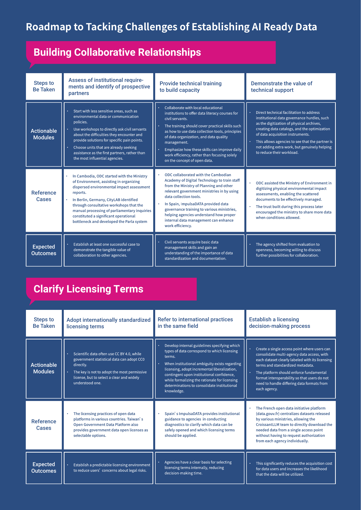
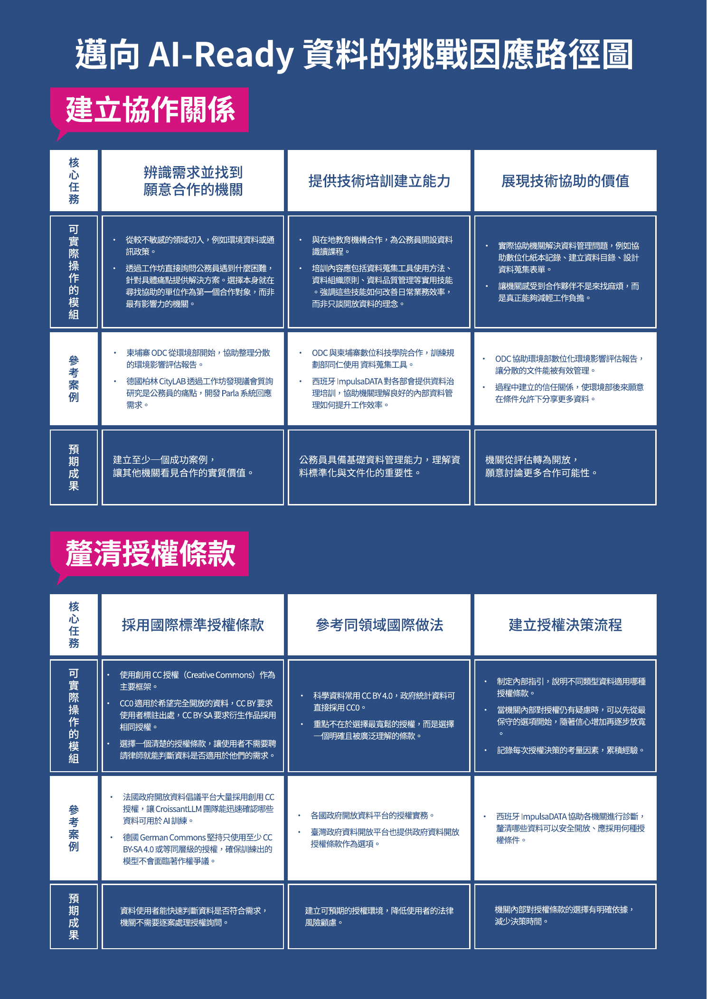
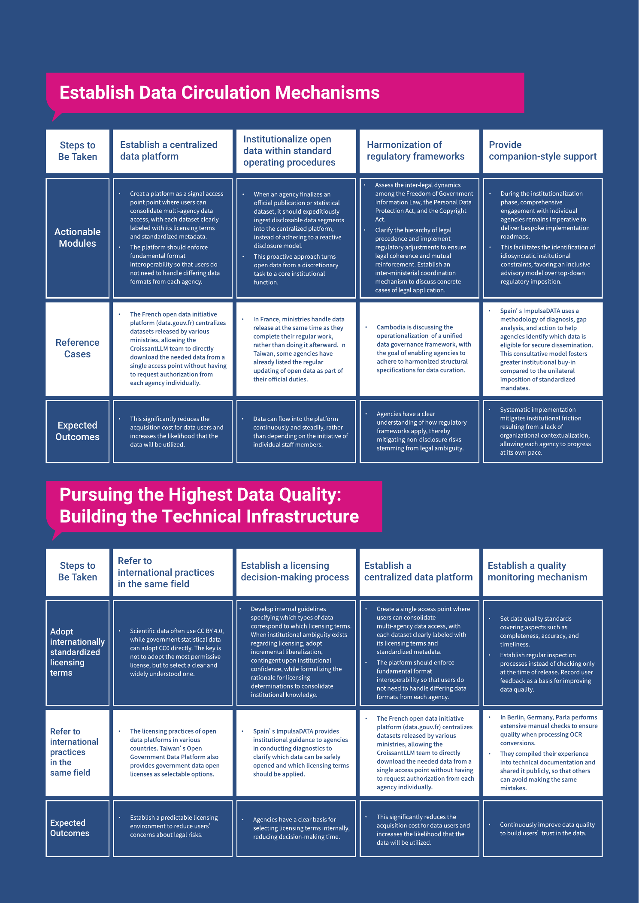
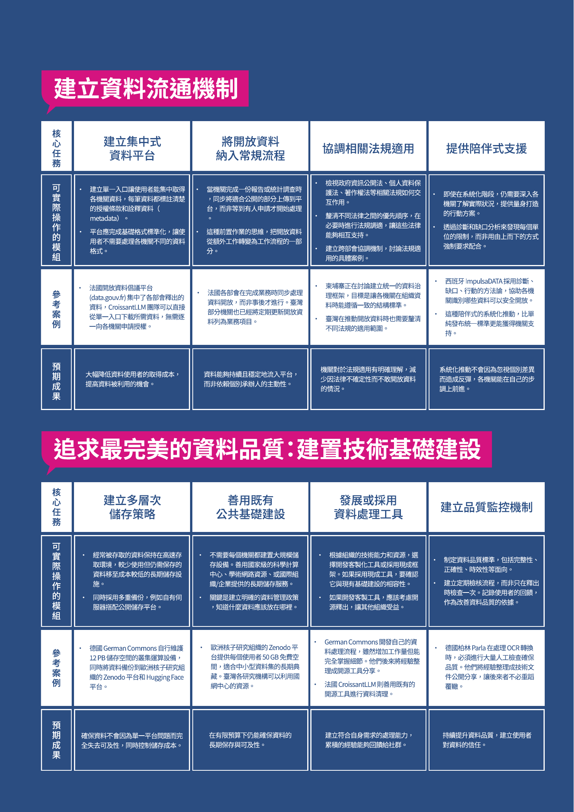

# Chapter 5: Conclusion and Roadmap for Promoting AI-Ready Open Data / 第五章 總結與 AI 開放資料推動藍圖

_Source pages: English PDF pp. 24-29; Traditional Chinese PDF pp. 21-25. Paragraph order is kept parallel by section where the two PDFs correspond._

## Figures / 圖片

## English

### 5.1 Implementation Modules and Roadmap

Promoting government data toward AI-ready is not a linear, one-way process; rather, it consists of a series of actionable modules that can be deployed according to the needs of each agency. In practice, individual agencies frequently encounter multifaceted and concurrent challenges. For example, an agency may have strong hardware infrastructure yet encounter institutional ambiguity regarding licensing terms, or face operational hurdles in optimizing data interoperability for AI while fostering strategic partnerships. The pace of development can also vary across agencies: some departments may advance more expeditiously due to the nature of their work or organizational culture, while others require more time to establish trust. Based on international case studies, this research categorizes these successful outcomes into four operational modules. Agencies can dynamically combine these practical recommendations according to the challenges they are currently facing, rather than adhering to a rigid, linear implementation path.

This chapter draws on the concrete experiences accumulated from the five case studies, sequentially outlining the technical choices for format conversion, practical methods for personal data de-identification, identification and handling of training data biases, and the planning of long-term data management infrastructure. Each topic presents the tools used in the cases, the limitations encountered, and the considerations behind selecting specific approaches, focusing on actionable steps that frontline practitioners can apply. Some agencies or teams, motivated by professional responsibilities or service quality considerations, may wish to invest extra effort in data processing. This chapter serves as a practical guide for those readers.

This table is designed to help readers quickly identify their own situation and find relevant reference cases. It is important to understand that each case has found feasible solutions within its own constraints, and these solutions are not mutually exclusive-they can be referenced and flexibly combined.

It is not necessary to follow every step exactly.

What matters more is that these solutions are interdependent.

The trust built through collaboration is the foundation for subsequent systematic implementation. Companionship mechanisms developed to overcome obstacles can help more agencies cross initial thresholds. Technical experience accumulated for pursuing high-quality data can be shared back with implementers as a reference. This flexible yet robust approach often handles the complexities of real-world environments better than strictly adhering to a predefined roadmap.

### 5.2 AI-Ready Data Empowering Democracy and Society

When discussing the integration of open data with AI, it is easy to get caught up in purely technical debates and overlook the the more fundamental questions for civil servants, citizens, and stakeholders other than business sectors: ’What is all this for?’ From the cases examined in this study, we identified three dimensions of empowerment, which together form the foundational value of open data in contemporary society.

#### 5.2.1 Empowering Civil Servants in Their Work

The most direct beneficiaries of open data initiatives are ultimately the civil servants themselves. The experience of the Parla project provides a robust empirical illustration of this principle. Consultative workshops with Berlin’s administrative personnel identified the manual processing of parliamentary inquiries as a significant operational bottleneck, the solutions developed by CityLAB not only helped them save time but, more importantly, enabled them to respond more effectively to members of parliament, thereby improving the quality of their work.

Spain's ImpulsaDATA program reflects the same value. In the interview, Carlos Alonso Peña, Director of the Spanish Data Office Division, mentioned that many agencies, after receiving guidance, found that establishing good internal data governance not only facilitates external data release but also improves internal workflows. When data is properly organized and managed, staff can handle information retrieval, report preparation, and responses to tasks assigned by superiors much more efficiently. These internal benefits often serve as a key motivation for agencies to continue investing in open data initiatives.

The data literacy training that ODC provides to Cambodian government agencies illustrates the same logic. By helping agencies understand how to organize and manage data, ODC not only lowers the barriers to data release but also enhances the agencies' administrative effectiveness. This experience demonstrates that promoting open data should not be seen as an additional burden, but rather as an opportunity to strengthen the overall capacity of the public service system.

#### 5.2.2 Empowering Citizens’ Knowledge and Participation

The contribution of open data to democracy goes beyond increasing transparency; it also lies in how it enables citizens to participate more effectively in public affairs. A typical example is the economic land concession map created by ODC in Cambodia. Before this map existed, indigenous communities had difficulty knowing which lands had been designated as concessions and which areas were still available for community use. Once this information was visualized, communities could concretely advocate to the government for the protection of their traditional territories. When such data is released in an AI-ready format, even citizens without specialized legal or spatial analysis backgrounds can potentially feed structured data into large language models to expeditiously summarize the potential impacts of specific development projects on their traditional territories, or even request AI to generate discussions about these projects.

This form of empowerment helps translate transparency from a principle into practical civic agency. When citizens have access to structured data, they can conduct their own analyses, formulate evidence-based inquiries, or develop alternative solutions. Data-driven civic participation is often more persuasive than non-empirical or purely rhetorical advocacy and is more likely to drive substantive policy change. Such empowerment shifts democratic engagement from passive awareness to active involvement. With well-structured raw data, citizens can use tools like ChatGPT to analyze information, transforming originally dense government budgets or meeting records into accessible, plain-language insights.

Most importantly, combining AI with open data lowers the expertise barrier to public participation. Previously, only senior researchers or large interest groups had the resources to conduct large-scale data analysis. Now, any citizen with basic questioning skills can leverage AI assistance to engage in evidence-based dialogue with the government. When open data transitions from passive digital information to AI-interoperable content, enabling automated synthesis and analysis, it not only strengthens citizens’ right to information but also enhances the efficacy of transparent oversight mechanisms regardless of resource limitations, reshaping the balance of power between citizens and government.

#### 5.2.3 Empowering AI with Cultural Diversity

When viewed from a global perspective, the significance of open data for AI development goes beyond a purely technical issue; it touches on fundamental matters of cultural preservation and sovereignty. The goal of the CroissantLLM project is to build a truly bilingual French model, because the team observed that models claiming to support French often only include a small amount of French data within predominantly English training corpora, resulting in performance on French tasks that lags far behind their English capabilities.

The seriousness of this issue lies in the fact that if a country’s language is underrepresented in training data, its citizens risk being marginalized or misinterpreted when using mainstream AI models. Models tend to output values and perspectives present in dominant training datasets. If historical events are deficient in localized linguistic nuances, models may rely on foreign media or biased minority sources to interpret history, leading to distorted public understanding of their own past.

ODC’s experience further highlights the complexity of handling linguistic diversity. Staff members noted in the interviews that Cambodia’s language challenges extend beyond Khmer and English to include numerous indigenous languages. If data are concentrated only on urban or dominant languages, the voices of rural communities and indigenous peoples risk disappearing from the digital sphere.

This cultural-level inequality is likely to become even more pronounced as AI applications become more widespread.

In this context, the role of government is particularly crucial.

When private enterprises tend to collect data with commercial value, governments bear the responsibility to release data that may seem niche but possess high public value-such as local gazetteers, dialect records, or infrastructure data from remote areas. Although these data may not be commercially profitable, they are an essential piece in correcting cultural biases in AI models and building a digital environment that preserves local subjectivity.

The German Commons project, which faced challenges of temporal bias, offers a similar lesson. Because copyright restrictions mean that available cultural works are largely historical documents, models trained on them may adopt outdated language and phrasing. While this problem cannot be fully resolved within existing legal frameworks, it serves as an important reminder: how should governments adjust copyright policies or data release strategies to ensure that contemporary culture is also learnable and preservable by AI models?

#### 5.2.4 Towards a Sustainable Open Data Ecosystem

When civil servants realize that open data can improve their work efficiency, they become more willing to engage in these efforts. When citizens can effectively use open data to participate in public affairs, [18] the government experiences positive feedback from data release. And when AI models can more accurately understand and generate local languages and cultures, society as a whole benefits from more appropriate and effective digital services.

Carlos Alonso Peña, Director of the Spanish Data Office Division, highlighted a particularly important point about cultural change. He noted that the greatest challenge in promoting open data is not technical or legal, but organizational culture. When civil servants fear making mistakes or worry that the quality of data is insufficient and might be criticized, open data initiatives stall. However, if the narrative is reframed so that agencies understand that open data is not just about external oversight but also about internal improvement, enabling better citizen participation, and ensuring that local culture is not marginalized in the AI era, the resistance to implementation is greatly reduced.

From this perspective, integrating open data with AI is not merely a technical upgrade. It is about whether civil servants can serve citizens more effectively, whether citizens can genuinely participate in public decision-making, and whether a country’s culture and language can maintain subjectivity in the digital age. These three dimensions of empowerment together form the deeper significance of promoting open data and represent the core purpose that should always be remembered amid various technical and institutional challenges.

### 5.3 Research Limitations and Future Outlook

This study was conducted between August and December 2025. During this period, governments, civic organizations, and academic institutions worldwide continued to release more AI-ready datasets based on open data, as well as publish new policies and research findings. Due to the constraints of the project timeline, it is possible that the collection of cases and the study itself may not be fully comprehensive, and readers’ understanding is appreciated.

Most of the case studies in this report were selected and presented based on the project inventory in Chapters Two and Three and the TOE quadrant blueprint. However, as noted above, AI development across countries is rapidly evolving, and the classification of cases within the analytical matrix remains inherently dynamic. Due to time limitations, this report can only reflect the situation for the majority of the project period. Additionally, cases in the fourth quadrant-characterized by high technological development but low organizational and environmental maturity-remain relatively scarce.

Finally, this study was conducted by a Taiwanese research team, and during the process, we interviewed six experts from the public sector, civic tech communities, and AI data training communities. These experts suggested several Taiwanese cases for potential future investigation. For example, in September, the Ministry of Digital Affairs announced an AI-ready metadata framework, providing Taiwan’s government agencies with more opportunities to improve data quality and its documentation. Additionally, at the end of December, the Ministry officially released Taiwan Sovereign AI Corpus. During the same period, Switzerland also released its own sovereign AI dataset. These cases represent opportunities for the team’s future research. At the same time, Taiwanese government agencies have suggested that, for domestic cases, further integration of local contexts and dialogue with civil servants could be achieved by developing additional operational toolkits or checklists highlighting key aspects of certain cases. This is also the direction our team hopes to pursue in future dialogues.

### 5.4 Conclusion

This report hopes that by documenting these cases, it can serve as a mirror to help public sector workers understand their own roles. Through these writings and the close-to-practice international examples, each agency and every officer can recognize their current position and understand that, even when still in the early stages or facing obstacles, their efforts carry public value. Open data and AI are not solely the domain of technical units or early adopters; they are a collective endeavor in which everyone involved in public service can gradually participate and steadily contribute.

At the same time, this report is intended to serve as a ’communication material’ between the government and civil society. For NGOs and civic tech communities, when engaging with government agencies of varying maturity levels and knowledge backgrounds, it provides concrete examples of ’how to get started,’ ’how others have progressed,’ and ’which paths are feasible and adaptable.’ Such dialogue moves beyond abstract advocacy and is grounded in practical experience and actionable steps.

Future researchers and policymakers are invited to view these cases as a starting point for ongoing dialogue. As AI technologies, regulatory environments, and societal expectations continue to evolve, governance models for open data will inevitably need continuous adjustment and redesign.

Only by establishing long-term collaboration and feedback mechanisms among government, academia, and civil society can this ecosystem grow sustainably. The more people can see their own roles along this path and understand each other’s constraints and expertise, the more open data can truly become a sustainable public infrastructure. This is not the responsibility of any single party, but a collective effort that must be shared and is worth achieving together.

## 繁體中文

本章內容來自五個案例在實際操作中累積的具體經驗，依序說明格式轉換的技術選擇、個資去識別化的實作方法、訓練資料偏見的辨識與處理，以及長期資料管理的基礎建設規劃。每個主題都會呈現案例中採用的工具、遭遇的限制，以及最終選擇特定做法的考量因素，聚焦在第一線工作者能夠實際應用的步驟。有些機關或團隊，基於專業職責或服務品質的考量，希望在資料處理上投入更多心力。這一章便是為這些讀者準備的指引。

### 5.1 推動模組與藍圖

推動政府資料邁向 AI-Ready 並非一條單向前進的直線，而是一系列根據機關需求隨時調用的行動模組，在實務運作中，一個機關往往會同時面臨多個面向的挑戰，例如在具備優良硬體基建的同時，卻可能對授權條款感到困惑，或是在建立協作關係的過程中，發現既有的資料格式難以被 AI 直接利用，不同機關之間的發展速度也可能大不相同，有些部門可能因為業務性質或組織文化而更容易推動，有些則需要更長的時間建立信任。因此，本研究將國際案例的成功經驗拆解為四個行動模組，機關可以根據自身當下遭遇的問題，靈活組合這些實務建議，而非強求循序漸進。

| 發展遭遇的困難 | 核心任務 | 可實際操作的模組 | 參考案例 | 預期成果 |
| ----- | ----- | ----- | ----- | ----- |
| 建立協作關係 | 辨識需求並找到願意合作的機關 | 從較不敏感的領域切入，例如環境資料或通訊政策。透過工作坊直接詢問公務員遇到什麼困難，針對具體痛點提供解決方案。選擇本身就在尋找協助的單位作為第一個合作對象，而非最有影響力的機關。 | 柬埔寨 ODC 從環境部開始，協助整理分散的環境影響評估報告。德國柏林 CityLAB 透過工作坊發現議會質詢研究是公務員的痛點，開發 Parla 系統回應需求。 | 建立至少一個成功案例，讓其他機關看見合作的實質價值。 |
|  | 提供技術培訓建立能力 | 與在地教育機構合作，為公務員開設資料識讀課程。培訓內容應包括資料蒐集工具使用方法、資料組織原則、資料品質管理等實用技能。強調這些技能如何改善日常業務效率，而非只談開放資料的理念。 | ODC 與柬埔寨數位科技學院合作，訓練規劃部同仁使用 資料蒐集工具。西班牙 ImpulsaDATA 對各部會提供資料治理培訓，協助機關理解良好的內部資料管理如何提升工作效率。 | 公務員具備基礎資料管理能力，理解資料標準化與文件化的重要性。 |
|  | 展現技術協助的價值 | 實際協助機關解決資料管理問題，例如協助數位化紙本記錄、建立資料目錄、設計資料蒐集表單。讓機關感受到合作夥伴不是來找麻煩，而是真正能夠減輕工作負擔。 | ODC 協助環境部數位化環境影響評估報告，讓分散的文件能被有效管理。過程中建立的信任關係，使環境部後來願意在條件允許下分享更多資料。 | 機關從評估轉為開放，願意討論更多合作可能性。 |
| 釐清授權條款 | 採用國際標準授權條款 | 使用創用 CC 授權（Creative Commons）作為主要框架。CC0 適用於希望完全開放的資料，CC BY 要求使用者標註出處，CC BY-SA 要求衍生作品採用相同授權。選擇一個清楚的授權條款，讓使用者不需要聘請律師就能判斷資料是否適用於他們的需求。 | 法國政府開放資料倡議平台大量採用創用 CC 授權，讓 CroissantLLM 團隊能迅速確認哪些資料可用於 AI 訓練。德國 German Commons 堅持只使用至少 CC BY-SA 4.0 或等同層級的授權，確保訓練出的模型不會面臨著作權爭議。 | 資料使用者能快速判斷資料是否符合需求，機關不需要逐案處理授權詢問。 |
|  | 參考同領域國際做法 | 科學資料常用 CC BY 4.0，政府統計資料可直接採用 CC0。重點不在於選擇最寬鬆的授權，而是選擇一個明確且被廣泛理解的條款。 | 各國政府開放資料平台的授權實務。臺灣政府資料開放平台也提供政府資料開放授權條款作為選項。 | 建立可預期的授權環境，降低使用者的法律風險顧慮。 |
|  | 建立授權決策流程 | 制定內部指引，說明不同類型資料適用哪種授權條款。當機關內部對授權仍有疑慮時，可以先從最保守的選項開始，隨著信心增加再逐步放寬。記錄每次授權決策的考量因素，累積經驗。 | 西班牙 ImpulsaDATA 協助各機關進行診斷，釐清哪些資料可以安全開放、應採用何種授權條件。 | 機關內部對授權條款的選擇有明確依據，減少決策時間。 |
| 建立資料流通機制 | 建立集中式資料平台 | 建立單一入口讓使用者能集中取得各機關資料，每筆資料都標註清楚的授權條款和詮釋資料（metadata）。平台應完成基礎格式標準化，讓使用者不需要處理各機關不同的資料格式。 | 法國開放資料倡議平台（data.gouv.fr）集中了各部會釋出的資料，CroissantLLM 團隊可以直接從單一入口下載所需資料，無需逐一向各機關申請授權。 | 大幅降低資料使用者的取得成本，提高資料被利用的機會。 |
|  | 將開放資料納入常規流程 | 當機關完成一份報告或統計調查時，同步將適合公開的部分上傳到平台，而非等到有人申請才開始處理。這種前置作業的思維，把開放資料從額外工作轉變為工作流程的一部分。 | 法國各部會在完成業務時同步處理資料開放，而非事後才進行。臺灣部分機關也已經將定期更新開放資料列為業務項目。 | 資料能夠持續且穩定地流入平台，而非依賴個別承辦人的主動性。 |
|  | 協調相關法規適用 | 檢視政府資訊公開法、個人資料保護法、著作權法等相關法規如何交互作用。釐清不同法律之間的優先順序，在必要時進行法規調適，讓這些法律能夠相互支持。建立跨部會協調機制，討論法規適用的具體案例。 | 柬埔寨正在討論建立統一的資料治理框架，目標是讓各機關在組織資料時能遵循一致的結構標準。臺灣在推動開放資料時也需要釐清不同法規的適用範圍。 | 機關對於法規適用有明確理解，減少因法律不確定性而不敢開放資料的情況。 |
|  | 提供陪伴式支援 | 即使在系統化階段，仍需要深入各機關了解實際狀況，提供量身打造的行動方案。透過診斷和缺口分析來發現每個單位的限制，而非用由上而下的方式強制要求配合。 | 西班牙 ImpulsaDATA 採用診斷、缺口、行動的方法論，協助各機關識別哪些資料可以安全開放。這種陪伴式的系統化推動，比單純發布統一標準更能獲得機關支持。 | 系統化推動不會因為忽視個別差異而造成反彈，各機關能在自己的步調上前進。 |
| 追求最完美的資料品質：建置技術基礎建設 | 建立多層次儲存策略 | 經常被存取的資料保持在高速存取環境，較少使用但仍需保存的資料移至成本較低的長期儲存設施。同時採用多重備份，例如自有伺服器搭配公開儲存平台。 | 德國 German Commons 自行維護 12 PB 儲存空間的叢集運算設備，同時將資料備份到歐洲核子研究組織的 Zenodo 平台和 Hugging Face 平台。 | 確保資料不會因為單一平台問題而完全失去可及性，同時控制儲存成本。 |
|  | 善用既有公共基礎建設 | 不需要每個機關都建置大規模儲存設備。善用國家級的科學計算中心、學術網路資源、或國際組織/企業提供的長期儲存服務。關鍵是建立明確的資料管理政策，知道什麼資料應該放在哪裡。 | 歐洲核子研究組織的 Zenodo 平台提供每個使用者 50 GB 免費空間，適合中小型資料集的長期典藏。臺灣各研究機構可以利用國網中心的資源。 | 在有限預算下仍能確保資料的長期保存與可及性。 |
|  | 發展或採用資料處理工具 | 根據組織的技術能力和資源，選擇開發客製化工具或採用現成框架。如果採用現成工具，要確認它與現有基礎建設的相容性。如果開發客製工具，應該考慮開源釋出，讓其他組織受益。 | German Commons 開發自己的資料處理流程，雖然增加工作量但能完全掌握細節。他們後來將經驗整理成開源工具分享。法國 CroissantLLM 則善用既有的開源工具進行資料清理。 | 建立符合自身需求的處理能力，累積的經驗能夠回饋給社群。 |
|  | 建立品質監控機制 | 制定資料品質標準，包括完整性、正確性、時效性等面向。建立定期檢核流程，而非只在釋出時檢查一次。記錄使用者的回饋，作為改善資料品質的依據。 | 德國柏林 Parla 在處理 OCR 轉換時，必須進行大量人工檢查確保品質。他們將經驗整理成技術文件公開分享，讓後來者不必重蹈覆轍。 | 持續提升資料品質，建立使用者對資料的信任。 |

這張表格想幫助讀者快速定位自己所處的情境，並找到相應的參考案例。重要的是理解，每個案例都在自己的限制條件下找到了可行的解方，而這些解方之間並不互斥，而是可以相互借鑑、靈活組合。

#### 並不用每一步都照著走

更重要的是，這些解方之間存在著相互依存的關係。協作中建立的信任關係，會成為後續系統化推動的基礎。遇到阻力時發展的陪伴機制，能夠幫助更多機關跨過門檻。追求卓越品質時累積的技術經驗，可以回饋給推動者作為參考。這種彈性且穩健的發展方向，往往比嚴格遵循某個既定路線圖更能應付實際環境的複雜程度。

### 5.2 AI-Ready 資料賦能民主與社會

當談論開放資料邁向 AI 整合運用時，容易陷入純粹技術的討論，忽略了更根本的問題，「這一切為了什麼？」從這次研究的案例中，本研究發現了三個面向的賦能可能性，它們共同構成了開放資料在當代社會的價值基礎。

#### 5.2.1 賦能公務員自身的工作

開放資料推動工作最直接的受益者，最終是公務員自己。Parla 專案的經驗清楚展現了這一點。當柏林行政機關的員工在工作坊中表達研究議會質詢是一項耗時的任務時，CityLAB 開發的解決方案不僅幫助他們節省時間，更重要的是讓他們能夠更有效地回應民意代表的質詢，提升工作品質。

西班牙的 ImpulsaDATA 計畫同樣體現了這個價值。西班牙資料總局局長 Carlos Alonso Peña  在訪談中提到，許多機關在接受輔導後發現，建立良好的內部資料治理不僅有助於對外釋出資料，更能改善內部的工作流程。當資料被妥善組織和管理時，承辦人員在查找資訊、製作報告或回應上級交辦事項時，都能更加得心應手。這種內部效益往往是推動機關持續投入的重要動力。

ODC 為柬埔寨政府機關提供的資料識讀能力培訓，也展現了相同的邏輯。透過協助機關理解如何組織和管理資料，ODC 不僅降低了資料釋出的門檻，更提升了機關本身的行政效能。這個經驗說明，開放資料推動工作不應該被視為額外的負擔，而應該被理解為提升公務體系整體能力的契機。

#### 5.2.2 賦能民眾的知情與參與

開放資料對民主的貢獻，不僅體現在透明度的提升，更體現在它如何讓民眾能夠更有效地參與公共事務。ODC 建立的經濟性土地特許權地圖就是一個典型案例。在這個地圖出現之前，柬埔寨的原住民社區很難了解哪些土地已被劃為特許區，哪些區域仍可供社區使用。當這些資訊以視覺化的方式呈現時，社區能夠具體地向政府倡議，要求保護傳統領域。然而當這些資料以 AI-Ready 格式釋出時，即使不具備專業法律或空間分析背景的公民，或許也能直接將結構化資料導入大型語言模型，快速摘要出特定開發案對其傳統領域的潛在影響，甚至要求 AI 生成針對該計畫的討論。

這種賦能帶來了具體的行動能力，並不抽象。當民眾能夠取得結構化的資料，他們可以進行自己的分析、提出有根據的質疑、或是發展替代方案。這種基於資料的公民參與，往往比純粹的情感動員更具說服力，也更能促成政策的實質改變。這種賦能讓民主參與從被動的知情轉向行動。當民眾能取得結構良好的原始資料，他們可以運用如 ChatGPT 等工具進行資料分析，將原本生澀的政府預算表或會議紀錄轉化為易於理解的白話文分析。

更重要的是，AI 與開放資料的結合徹底打破了公共參與的專業門檻。過去只有資深研究者或大型利益團體才有資源進行大規模的資料分析，現在任何一位具備基本提問能力的公民都能藉由人工智慧的輔助，與政府進行基於資料分析結果的對話。當開放資料不再只是靜態的網頁資訊，而是成為能被 AI 快速處理、分析與生成的內容時，不僅強化了公民的知情權，透明監督的力道將不再受限於資源的限制，也重塑了公民與政府間的權力平衡。

#### 5.2.3 賦能 AI 的文化多樣性

當視角拉高到全球層次，開放資料對於 AI 發展的意義就不僅僅是技術問題，而是關乎文化保存與主權的根本議題。CroissantLLM 專案的目標就是打造一個真正雙語的法語模型，因為團隊觀察到市面上聲稱支援法語的模型，往往只是在以英語為主的訓練資料中摻入少量法語內容，導致模型在法語任務上的表現遠不如英語。

這個問題的嚴重性在於，如果一個國家的語言資料在訓練集中的佔比極低，該國在使用主流 AI 模型時將面臨被邊緣化與被錯誤解讀的問題。模型會傾向於輸出訓練資料中強勢文化的價值觀，如果歷史事件在模型中缺乏在地觀點的訓練語料，模型可能會根據外國媒體或帶有偏見的少數資料來解釋歷史，導致民眾對自身歷史的認知出現偏差。

ODC 的經驗更突顯了語言多樣性處理的複雜性。工作人員在訪談中指出，柬埔寨的語言障礙不僅僅是高棉語與英語之間的問題，還涉及眾多原住民族語言。如果資料只集中在城市或優勢語言，鄉村與原住民族的聲音就會在數位世界中消失。這種文化層面的不平等，將隨著 AI 應用的普及而更加嚴重。

政府在這個脈絡下的角色特別關鍵。當民間企業傾向蒐集具商業價值的資料時，政府更有責任釋出那些看似冷門、卻具備高度公共價值的資料，例如地方誌、方言紀錄或是偏鄉的基礎建設資料。這些資料或許無利可圖，但對於修正 AI 模型的文化偏見、建構具備在地主體性的數位環境而言，卻是不可或缺的關鍵拼圖。

German Commons 專案面對的時間偏見問題也提供了類似的啟示。由於著作權保護導致可用的文化作品多為歷史文獻，訓練出來的模型可能在語氣和用詞上顯得過時。這個問題雖然在現有法律框架下難以完全解決，但它亦提供了提醒與思考：政府應該如何調整著作權政策或資料釋出策略，才能確保當代文化也能被 AI 模型學習和傳承？

#### 5.2.3 邁向可持續的開放資料生態系

當公務員發現開放資料能夠改善自己的工作效率時，他們會更願意投入這項工作。[^13] 當民眾能夠有效利用開放資料參與公共事務時，政府會感受到釋出資料的正面回饋。當 AI 模型能夠更準確地理解和生成在地語言與文化時，整個社會都能受益於更適切的數位服務。

西班牙資料總局局長 Carlos Alonso Peña Carlos 提到的文化轉變特別值得關注。他指出，推動開放資料最大的挑戰不是技術或法律，而是組織文化。當公務員害怕犯錯、擔心資料品質不夠好而遭到批評時，開放資料就會停滯不前。但如果能夠改變敘事框架，讓機關理解開放資料不是為了外部監督，而是為了內部改善，同時也是為了讓公民更好地參與，更是為了確保在地文化在 AI 時代不被邊緣化，那麼推動的阻力就會大幅降低。

從這個角度來看，開放資料邁向 AI 整合運用不只是技術升級，更關乎公務員能否更有效地服務民眾，民眾能否真正參與公共決策，還有一個國家的文化與語言能否在數位時代保有主體性。這三個面向的賦能共同構成了推動開放資料工作的深層意義，也是在面對各種技術和制度挑戰時，應該始終記得的初衷。

### 5.3 研究限制與未來展望

本份研究的執行期間為 2025 年 8 月至 12 月期間。這段時間全球的政府機關、公民團體或學術單位皆持續釋出更多基於開放資料的 AI-Ready 資料集，或者公布新的政策或研究成果。考量因專案時程限制，恐致個案收集與研究未臻完備，敬請海涵。

另本案多數個案研究皆依據第二和三章的專案盤點及 TOE 象限藍圖挑選和呈現。惟呈上所述，各國在 AI 發展日新月異，因此在象限中的位置理論上也應動態移動， 本報告礙於時程限制，僅能反映專案期間多數期間之情形。同時在第四象限，在高技術發展卻是低組織與環境脈絡成熟度的案例，也是相對缺乏的。

最後，本研究源於臺灣團隊，在過程中亦有訪談 6 位來自公部門、公民科技社群、AI 資料訓練家社群中的專家，其均有分別提出未來得以近一步訪談的臺灣案例，例如數位發展部在 9 月公告的 AI-Ready 的詮釋資料框架，給予臺灣政府機關更多提升資料品質及其描述的機會；同時 12 月底，數位部也正式釋出臺灣的臺灣主權AI訓練語料庫。此外。瑞士亦有在這期間釋出其專屬的主權 AI 資料集。這些均是本團隊期待未來得以近一步研究的。同時臺灣的公務機關亦有提出，針對臺灣案例得以如何進一步融合在地化的脈絡與國內公務員對話，則會建議有將部分案例亮點再發展出更多對應的懶人包或檢核表，這也未來本團隊希望對話發展方向。

### 5.4 總結

本報告期待，透過這些案例的書寫，能成為一面鏡子，幫助政府機關內的工作者理解自身角色。透過這些書寫、貼近實務的國際案例，每一個機關、每一位承辦人員，都能辨識自己當下所處的位置，理解即使仍在起步或面臨阻力，所做的努力依然具有公共價值。開放資料與 AI 並非只屬於技術單位或先行者，而是所有參與公共服務的人，都能逐步投入、逐步累積的共同工程。

同時，也期待這份成果能成為政府與民間之間的「溝通材料」。對於 NGO 與公民科技社群而言，在面對不同成熟度、不同知識背景的政府機關時，能夠以具體案例說明「可以怎麼開始」、「別人是怎麼走過來的」，以及「哪些路徑是可行且可調整的」。這樣的對話，將不再停留在抽象的理念倡議，而是建立在實際經驗與可落地行動之上。

也邀請後續研究者與政策制定者，將這些案例視為持續對話的起點。隨著 AI 技術、法規環境與社會期待不斷變化，開放資料的治理模式勢必需要持續修正與再設計。唯有在政府、學界與公民社群之間建立長期的合作與回饋機制，這套生態系才能穩健成長。更多人能在這條路上看見自己的位置、理解彼此的限制與專業，開放資料才會真正成為一項可持續的公共基礎建設。這不是某一方的責任，而是一場需要被共同承擔、也值得被共同完成的集體行動。
